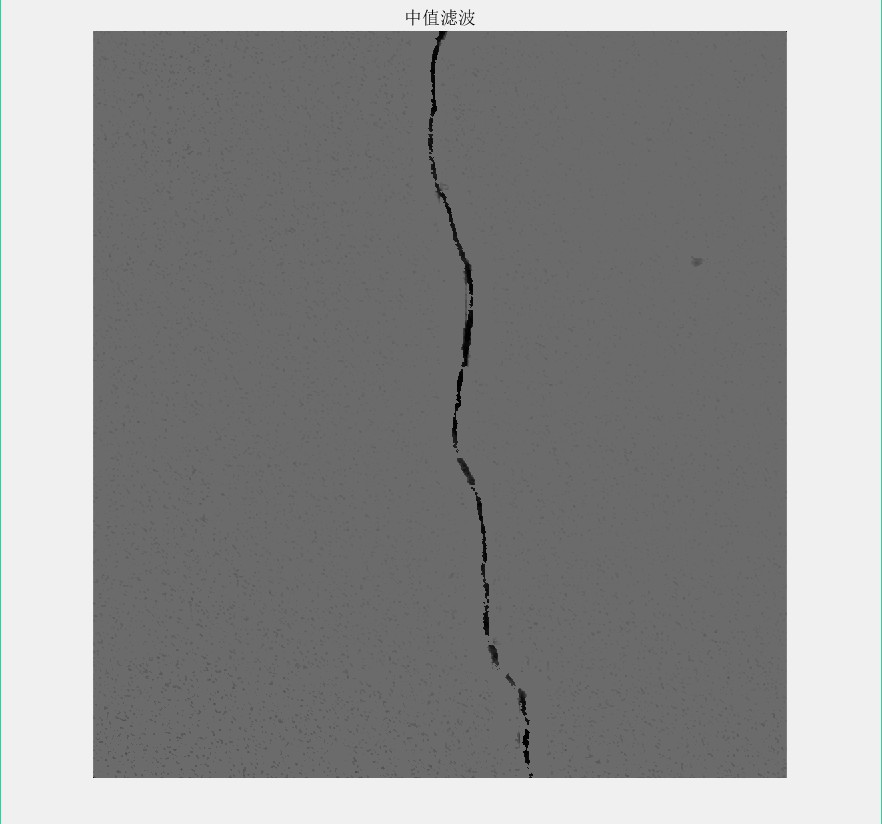

# report

## 2. 项目流程

> 这里塞一张项目流程图

​	项目如上图所示，对输入图像先进行预处理，进行光照均衡等操作；然后对预处理后的图像进行多结构的中值滤波处理，去除噪声；其次对降噪后的图像进行对比度增强处理以区分裂缝与背景；对对比度增强后的图像进行边缘检测，提取裂缝轮廓；最后与原图进行叠加，检测裂缝。

### 1. 图像预处理

​	照相机所获取的裂缝照片通常那个存在着各种复杂的噪声成分：裂缝所在平面材料颗粒形成的大范围随机纹理覆盖整幅图像；光照不均匀引起的中间亮周围暗的典型变化；相机固有的因辅助照明不均引起的噪点。因此要对输入图像进行预处理，对图像进行灰度校正。裂缝一般有如下规律：

1. 裂缝具有线性稀疏性，裂缝是不规则延展却具有一定方向性的线性目标，即使由于光照角度，裂缝中间出现了断裂，其线性增长方向局部一致。无论是空间上所占图像面积比例还是灰度级所占比例，即使是严重的网状裂缝，也不超过30%。

2. 裂缝中心的灰度是局部最小值，即使对于图像较暗区域，也是比背景略黑。因此，应根据亮度变化赋予各区域不同的校正权值。

3. 局部小窗口范围可认为图像光照近似均匀。

   据此，校正过程如下：

   将输入图像划分位$L * L$的小块$I_r$ 。分别统计各小块中各灰度级$k$的像素个数$N_{r, k}$，计算满足
   $$
   \sum^l_{k=0}N_{r,k} \ge \omega_r * N_r,\quad k,l\in[0,255]
   $$

的灰度级$l$。$N_r$表示改小块中所有像素个数。$\omega_r$为第$r$个小块的权重，由裂缝稀疏性和不同小块的明暗程度决定，即
$$
\begin{eqnarray}\omega_r=
\begin{cases}
exp(\frac{-|g_{avg}\ -\ g_r|}{2(g_{avg}\ -\ g{min})})\omega_s\qquad g_r<g_{avg}\cr  \omega_s \qquad\qquad\qquad \qquad \quad \ \ g_r\ge g_{avg}\end{cases}
\end{eqnarray}
$$
式中，$g_r$、$g_{avg}$、$g_{min}$分别为第$r$个小块的灰度平均值、所有分块的灰度均值以及最小的分块均值。$\omega_s$表示标准的光照均匀的小块中裂缝所占比重，取经验值0.3 。

​	对快内每个像素$I_r(x,y)$灰度校正
$$
\begin{eqnarray}I_r(x,y)=
\begin{cases}
\frac{\sum^M_{i=1} \sum^N_{j=1}I(i,j)}{M*N}\quad I_r(x,y)>l_r=\frac{\sum^l_{k=0}k*N_{r,k}}{\sum^l_{k=0}N_{r,k}}\cr  I_r(x,y) \qquad \quad \ \ other\end{cases}
\end{eqnarray}
$$
式中，M、N为图像长宽，$I(x,y)$为点$(i,j)$处灰度值，$l_r$为区分预设裂缝目标与背景的阈值。

图片1为原图，图片2为预处理后的图像，其中分块大小L为40 。

### 2. 中值滤波

​	对预处理后的图像进行滤波，为了更好地把噪声滤除，将形态学中地结构元素引入到中值滤波中来。如图片3所示，其原理为采用4中形状的3x3结构元素对图像进行依次滤波处理。由于采用了多种结构元素，因此可以对多种噪声进行有效地滤除。

图片4为中值滤波后的结果

### 3. 对比度增强

​	高帽变换是通过利用原始图像与原始图像开操作的结果图像进行图像减操作实现的；而低帽变换是通过原始图像闭操作的结果图像与原始图像进行图像减操作实现的。高帽变换具有高通滤波的特性，适用于处理具有暗背景、亮物体特征的图像。低帽变换能够检测图像中的谷值，适用于处理具有亮背景、暗物体特征的图像。将两者结合可以使图像的对比度得到增强。

图片5为对比度增强后的结果。

### 4. 边缘检测

​	为了识别出裂缝，对对比度增强后的图像进行阈值为0.3的canny算子边缘检测，将裂缝的轮廓描画出来。

图片6为边缘检测后的结果

​	从结果可以看出，裂缝边缘断断续续，因此需要进行图像闭操作，将断断续续的地方连接起来，使裂缝成为整体。

图片7为闭操作后的裂缝

### 与原图叠加

​	为了使裂缝更加突出，将检测出的裂缝图像与原图像进行叠加，得到以下结果：

图片8为完成图

图片9为对另一张裂缝图进行检测

图片10为不进行预处理直接裂缝检查

## 结果分析

​	从对第一张的裂缝图检测可以发现，该算法对在暗光环境下拍摄的，噪点很多情况下的照片中的裂缝检测效果较好，但由于噪声影响，检测出的裂缝还是有断裂的地方出现，但这可以与原图叠加的方法进行区别。根据裂缝处灰度较小，可以叠加检测到的裂缝图样，这样子较深处即为裂缝，较浅处为噪点。

​	将该算法运用于另一张图，可以发现该算法对于分辨率不高的裂缝图中的细小裂缝检测成功率较低，细小的裂缝被错误当作噪声被滤除了。但是该图具有复杂的材质纹理，不进行灰度校正直接对该图进行裂缝检测可以发现，不规则的纹理会产生大量的噪声小块，但是细小的裂缝也能被识别为裂缝。因此可以得出结论，对输入图像先进行预处理（灰度校正）以及噪声滤除处理，可以去除不规则纹理屏幕对裂缝检测算法的影响，但是由于预处理以及滤波会使原图像的信息损失，对细小的裂缝检测并不友好。